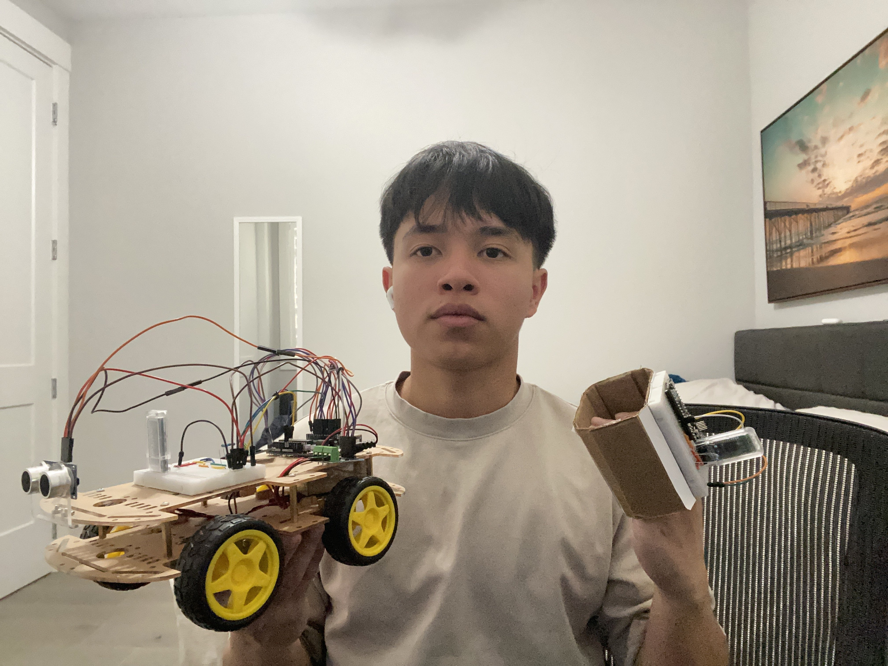
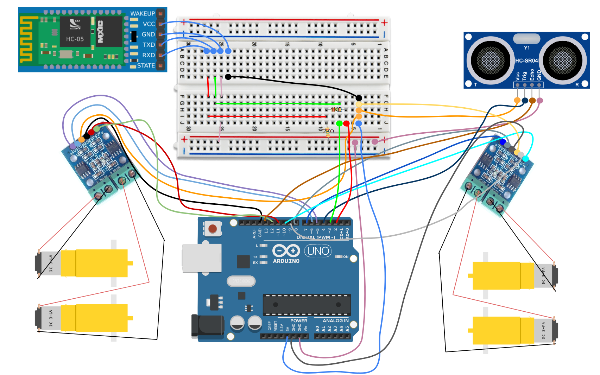
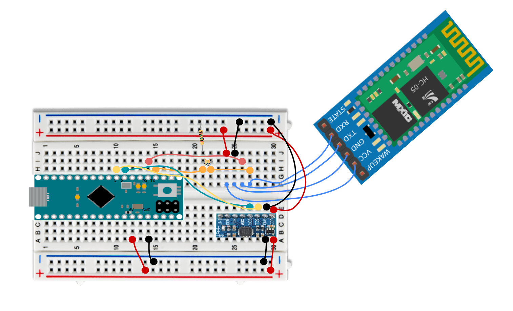

# Gesture Controlled Robot
The Gesture Controlled Robot is a Bluetooth-powered project consisting of two separate components: the car itself and the controller. The controller isn't your typical joystick, as it uses your hand gestures to move the car accordingly with the use of an accelerometer. The project consists of lots of wiring and coding which caused many setbacks in my project but I was still able to persevere and complete the project.

| **Engineer** | **School** | **Area of Interest** | **Grade** |
|:--:|:--:|:--:|:--:|
| Tristan F | Dublin High School | Electrical Engineering | Incoming Senior



# Final Milestone
<iframe width="560" height="315" src="https://www.youtube.com/embed/_9JPpcqdADI?si=sVyLAJbtnQgzalOG" title="YouTube video player" frameborder="0" allow="accelerometer; autoplay; clipboard-write; encrypted-media; gyroscope; picture-in-picture; web-share" referrerpolicy="strict-origin-when-cross-origin" allowfullscreen></iframe>

In my final milestone, I added my modification which was an ultra-sonic sensor that can detect how close it is to an object while moving forward and will stop once the object is a close distance away from it. Not much was added to my project during this time other than the modification but I did run into problems with the ultra-sonic sensor since I wasn't sure how to get the correct code for it to start working. Overall, this was a fun part of my project since I was able to add something that was once an idea to my physical project and it was great seeing it work.

# Second Milestone
<iframe width="560" height="315" src="https://www.youtube.com/embed/5KBos3E3Dp8?si=DZT6kQ0G72HfWYza" title="YouTube video player" frameborder="0" allow="accelerometer; autoplay; clipboard-write; encrypted-media; gyroscope; picture-in-picture; web-share" referrerpolicy="strict-origin-when-cross-origin" allowfullscreen></iframe>

In my second milestone, I completed the baseline project of the gesture-controlled robot which involved building the controller, setting up and connecting the Bluetooth devices, and using the code that would run the final product. Throughout this week, I ran into many problems with the wiring which caused me to have many setbacks in my project where I had to reevaluate my project. Every time I thought I had fixed an error in my wiring a new one would appear which made the project very challenging during this milestone. Though it was a challenge, I got through it and was able to create my finished baseline product which was worth it in the end. I also began the start of my project modification that will be completed by my final milestone.

# First Milestone


<iframe width="560" height="315" src="https://www.youtube.com/embed/zn3DXvNNs7U?si=ZzzjrjTv6KVnhTuD" title="YouTube video player" frameborder="0" allow="accelerometer; autoplay; clipboard-write; encrypted-media; gyroscope; picture-in-picture; web-share" referrerpolicy="strict-origin-when-cross-origin" allowfullscreen></iframe>

I set up the code and build of the car during my first week and completed it which was my first milestone. By the end of the week, I had my car moving forward, backward, left, and right. How I set up my project was by using videos and online resources that showed me how to get my Arduino plugged into my H-bridges which are what control the motors. I experienced a lot of trial and error with my coding in making the correct outputs/wheels move in the proper direction when needed. Overall, I learned a lot during this project and was able to use my experience with breadboarding to solve a problem that involved getting the 5V port to more than one H-bridge by putting the 2 wires in the same row with a 5V wire.

# Schematics 
Car Schematic (Uno)

Controller Schematic (Micro)



# Code 
Arduino Uno
```c++
#include <SoftwareSerial.h>

#define tx 2
#define rx 3

SoftwareSerial configBt(rx, tx);

char c ="";

const int A_1B = 5;
const int A_1A = 6;
const int B_1B = 9;
const int B_1A = 10;
const int A_1B2 = 7;
const int A_1A2 = 8;
const int B_1B2 = 11;
const int B_1A2 = 12;

const int trigPin = 4;
const int echoPin = 13;

void setup() {
  // put your setup code here, to run once:
  Serial.begin(38400);
  configBt.begin(38400);
  pinMode (tx, OUTPUT);
  pinMode (rx, INPUT);

  Serial.begin(9600);
  pinMode (trigPin, OUTPUT);
  pinMode (echoPin, INPUT);

  pinMode(A_1B, OUTPUT);
  pinMode(A_1A, OUTPUT);
  pinMode(B_1B, OUTPUT);
  pinMode(B_1A, OUTPUT);
  pinMode(A_1B2, OUTPUT);
  pinMode(A_1A2, OUTPUT);
  pinMode(B_1B2, OUTPUT);
  pinMode(B_1A2, OUTPUT);
}

void loop() {

    if (configBt.available()){
    c = (char)configBt.read();
    Serial.println(c);
}


switch(c){

  case 'F':
    forward();
    break;

  case 'L':
    left();
    break;

  case 'R':
    right();
    break;

  case 'B':
    backward();
    break;

  case 'S':
  freeze();
  }

long duration, distance;
  
  // Send a pulse from the ultrasonic sensor
  digitalWrite(trigPin, LOW);
  delayMicroseconds(2);
  digitalWrite(trigPin, HIGH);
  delayMicroseconds(10);
  digitalWrite(trigPin, LOW);
  
  // Calculate distance based on the time taken for the echo
  duration = pulseIn(echoPin, HIGH);
  distance = (duration / 2) / 29.1;
  
  // Display the distance on the Serial Monitor
  Serial.print("Distance: ");
  Serial.print(distance);
  Serial.println(" cm");
  
  if (distance < 20) { // If an object is within 10 cm
    freeze();
  } else {
    switch(c);
  }
  
  delay(100);
}

void forward(){

  digitalWrite(A_1B, HIGH);
  digitalWrite(A_1A, LOW);
  digitalWrite(B_1B, LOW);
  digitalWrite(B_1A, HIGH);
  digitalWrite(A_1B2, HIGH);
  digitalWrite(A_1A2, LOW);
  digitalWrite(B_1B2, LOW);
  digitalWrite(B_1A2, HIGH);

}

//moves robot backwards
void backward() {
  digitalWrite(A_1B, LOW);
  digitalWrite(A_1A, HIGH);
  digitalWrite(B_1B, HIGH);
  digitalWrite(B_1A, LOW);
  digitalWrite(A_1B2, LOW);
  digitalWrite(A_1A2, HIGH);
  digitalWrite(B_1B2, HIGH);
  digitalWrite(B_1A2, LOW);

}

//turns robot right
void right() {
  digitalWrite(A_1B, HIGH);
  digitalWrite(A_1A, LOW);
  digitalWrite(B_1B, HIGH);
  digitalWrite(B_1A, LOW);
  digitalWrite(A_1B2, HIGH);
  digitalWrite(A_1A2, LOW);
  digitalWrite(B_1B2, HIGH);
  digitalWrite(B_1A2, LOW);

}

//turns robot left
void left() {
  digitalWrite(A_1B, LOW);
  digitalWrite(A_1A, HIGH);
  digitalWrite(B_1B, LOW);
  digitalWrite(B_1A, HIGH);
  digitalWrite(A_1B2, LOW);
  digitalWrite(A_1A2, HIGH);
  digitalWrite(B_1B2, LOW);
  digitalWrite(B_1A2, HIGH);

}

//stops robot
void freeze() {
  digitalWrite(A_1B, LOW);
  digitalWrite(A_1A, LOW);
  digitalWrite(B_1B, LOW);
  digitalWrite(B_1A, LOW);
  digitalWrite(A_1B2, LOW);
  digitalWrite(A_1A2, LOW);
  digitalWrite(B_1B2, LOW);
  digitalWrite(B_1A2, LOW);

}
```
Arduino Micro

```c++
#include <Wire.h>

#define MPU6050_ADDRESS 0x68

int16_t accelerometerX, accelerometerY, accelerometerZ;

void setup() {

  Wire.begin();
  Serial1.begin(38400);


  Wire.beginTransmission(MPU6050_ADDRESS);
  Wire.write(0x6B);
  Wire.write(0);
  Wire.endTransmission(true);

  delay(100);

}

void loop() {
  
  readAccelerometerData();
  determineGesture();
  delay(500);

}

void readAccelerometerData()

{
  Wire.beginTransmission(MPU6050_ADDRESS);
  Wire.write(0x3B);
  Wire.endTransmission(false);
  Wire.requestFrom(MPU6050_ADDRESS, 6, true);

  accelerometerX = Wire.read() <<8 | Wire.read();
  accelerometerY = Wire.read() <<8 | Wire.read();
  accelerometerZ = Wire.read() <<8 | Wire.read();
Serial.print(accelerometerX);
Serial.print(accelerometerY);
}

void determineGesture()
{
  if (accelerometerY >= 6500) {
    Serial1.write('F');
  }
  else if (accelerometerY <= -4000) {
    Serial1.write('B');
  }
  else if (accelerometerX <= -3250) {
    Serial1.write ('L');
  }
  else if (accelerometerX >= 3250) {
    Serial1.write('R');
  }
    else{
      Serial1.write('S');
    }
}
```

# Bill of Materials

| **Part** | **Note** | **Price** | **Link** |
|:--:|:--:|:--:|:--:|
| Car Chassis | Base of Car | $21.29 | <a href="https://www.amazon.com/perseids-Chassis-Encoder-Wheels-Battery/dp/B07DNXBFQN/ref=sr_1_10?crid=26TUUFVPI4E3P&dib=eyJ2IjoiMSJ9.b6A_uqlNY7c_XNSLuXfmFx3lnf3nSeLGG7KgC7ZRfC9FAK22FT6M83V1dTBEAvnkHgRE0NNpo0oADYqyV4P2HpY5BFGlLS5OXcRD4aEW4oZsKRGeNyx6VCcRs7hoENdwnlQ8hLuKGPpRNYNJns2n3xydphLJvzrAHjoARmRiwPmFpghbM1R-1qsX5oLcwUgeikl74r8tSpjraJ1ymDeFdq6Kf9PpSFMZnd112Ga4ex0Q4MCaQT605Nzcs1spfnEG27m1GZgqWH8y7CDjJa2srdlHjoSkiJWC8MTTn3ug0Zg.7oE32LVlD_UTGvu8buwQxem0Dpe5zyabMMu1Q39WiQs&dib_tag=se&keywords=robot%2Bchassis&qid=1715357415&s=toys-and-games&sprefix=robot%2Bchassi%2Ctoys-and-games%2C95&sr=1-10&th=1&qty=1&sbo=RZvfv%2F%2FHxDF%2BO5021pAnSA%3D%3D"> Link </a> |
| Screw Driver Kit | Screw driver | $6.99 | <a href="https://www.amazon.com/Small-Screwdriver-Set-Mini-Magnetic/dp/B08RYXKJW9/"> Link </a> |
| H Bridges | Motor/Arduino Connecter | $5.99 | <a href="https://www.amazon.com/Ferwooh-Stepper-Controller-2-5-12V-H-Bridge/dp/B0D17PJ2MS/ref=sr_1_1?crid=2OQ7UJ1VJLUHU&dib=eyJ2IjoiMSJ9.xPgxMG6cmxZRuRbSqT3QxSr9zBhiCzp3WpnCeGbZjJfW2wU1eHonQ9Yw7yZi2k6Q3PhHd4uR1wLLWBETfHe0SF_wYRGvOug585fW0fsZTX6ImNTMLCJR3VH7MrRlnR7uQ5g0XrAXnzyVOSTEAmuNKyuiUk_vhsIuCNv1HCMrPUyPtn7qKFCwz7vVMcvEXx5Ddy4TPQJlpbS_voU9at8F85yJM5O9Hp5bbg_xuIHUsuE2ePCbv4lATgHmgHzENtlSRiU4laurwSqTAEgEnv9gNIbmb5d2HT5qBLfNChqSyio.9Fh1mUFHx48E8QZCOAX5T2ZJxzbHHdu93PJ63MLUqpM&dib_tag=se&keywords=L9110S+DC&qid=1716940953&s=electronics&sprefix=l9110s+dc%2Celectronics%2C89&sr=1-1"> Link </a> |
| Arduino Uno Clone | Arduino used for the car | $16.99 | <a href="https://www.amazon.com/ELEGOO-Board-ATmega328P-ATMEGA16U2-Compliant/dp/B01EWOE0UU/ref=sr_1_2_sspa?crid=3A6NCD2X9JEMJ&dib=eyJ2IjoiMSJ9.AcWZy-Yg4mDTnhzEHozxzPZdVC5-KUL2tW-OQewDKpBB4brSpD-p4bn74WcXiW3KarYertgpNaLJ0VHKx0qsPqolKAhiz1GRG5BwJQl73cEvrlXIXNmqlpSvU7uu2aRVSwAZi9Gj2AjSPLM3esW1Gzy9xEiQ9oiR5LCNjh4MlYDx5mTm5sI4rsD4CFTipJnF572qXlickl35FRcCj8oMXQotumgqI4yEIq0HobOtIlEnNhtVB51JMBHhqtmmF_PC9WeHJ4ySUVVcv_gq3_VeG1aAEbdm4NXmmT6NOYPw4Qo.1PFdgFT22oqO5Mg6-6j_aUL_EV8tUPuaFrB5N9oaEX0&dib_tag=se&keywords=elegoo+arduino&qid=1716856465&s=electronics&sprefix=elegoo+arduino%2Celectronics%2C99&sr=1-2-spons&sp_csd=d2lkZ2V0TmFtZT1zcF9hdGY&psc=1"> Link </a> |
| Motors | DC motors that connect to H-Bridges and move the wheels | $10.99 | <a href="https://www.amazon.com/AEDIKO-Motor-Gearbox-200RPM-Ratio/dp/B09N6NXP4H/ref=sr_1_4?crid=1JP29NIWBLH2M&dib=eyJ2IjoiMSJ9.Wq3jKgOLbqtEP772vMD4pV5f-w3PLBdEpKqguykXOb0JFO14f4Dq0m_VDVUMUFtR8WFINUEticI3GXcoGqwXPqK9yIh04PhCktgccMz9zAUiKXMJPwmOTUp_6av3XuFD0lXo9WngN9iKI6YgZrhEEs9qnqbcB1GnvgntCdKz8Q1dFuNu61NgSE6Z8vBk3FRpaNcr1lCI7FApTiNi0Qce8gbfmMn6oUggZQHpIOKKZ6s.M7WsZ_ZZtm3rm93kKgw0NOxt1McVBYX6m55oGxu1xxI&dib_tag=se&keywords=dc+motor+with+gearbox&qid=1715911706&sprefix=dc+motor+with+gearbox%2Caps%2C126&sr=8-4"> Link </a> |
| Electronics Kit | Mainly used for the wires | $14.99 | <a href="https://www.amazon.com/Smraza-Electronics-Potentiometer-tie-Points-Breadboard/dp/B0B62RL725/ref=sxts_b2b_sx_reorder_acb_business?content-id=amzn1.sym.f63a3b0b-3a29-4a8e-8430-073528fe007f%3Aamzn1.sym.f63a3b0b-3a29-4a8e-8430-073528fe007f&crid=2IC3T44H3U3WG&cv_ct_cx=breadboard%2Bkit&dib=eyJ2IjoiMSJ9.TUd5tu2T8rmms7ZuJ0UzmbtpLL1zsu93bQM0PzwnP4E.sT0V0vL_QtbYv8ymVTCcRkhFNgBtRvRiT7G4FT1oGTE&dib_tag=se&keywords=breadboard%2Bkit&pd_rd_i=B0B62RL725&pd_rd_r=67e1f4ff-e3b9-44e4-b441-b4ae282f036b&pd_rd_w=UjFaP&pd_rd_wg=0xRoC&pf_rd_p=f63a3b0b-3a29-4a8e-8430-073528fe007f&pf_rd_r=BFGP77H27ZN31W4PZAW6&qid=1715911733&sbo=RZvfv%2F%2FHxDF%2BO5021pAnSA%3D%3D&sprefix=breadboard%2Bkit%2Caps%2C109&sr=1-2-9f062ed5-8905-4cb9-ad7c-6ce62808241a&th=1"> Link </a> |
| Breadboard Kit | Breadboards | $8.79 | <a href="https://www.amazon.com/Breadboards-Solderless-Breadboard-Distribution-Connecting/dp/B07DL13RZH/ref=sxts_b2b_sx_reorder_acb_business?content-id=amzn1.sym.f63a3b0b-3a29-4a8e-8430-073528fe007f%3Aamzn1.sym.f63a3b0b-3a29-4a8e-8430-073528fe007f&crid=1RAL6PA1TZ81Q&cv_ct_cx=breadboard+kit&dib=eyJ2IjoiMSJ9.TUd5tu2T8rmms7ZuJ0UzmbtpLL1zsu93bQM0PzwnP4E.sT0V0vL_QtbYv8ymVTCcRkhFNgBtRvRiT7G4FT1oGTE&dib_tag=se&keywords=breadboard+kit&pd_rd_i=B07DL13RZH&pd_rd_r=1e3e6f57-5578-4452-b230-90d43c79b5d3&pd_rd_w=rFN6B&pd_rd_wg=3mMuA&pf_rd_p=f63a3b0b-3a29-4a8e-8430-073528fe007f&pf_rd_r=JC9D7T4VYRDQ9HJVY5X8&qid=1715912837&s=electronics&sbo=RZvfv%2F%2FHxDF%2BO5021pAnSA%3D%3D&sprefix=breadboard+kit%2Celectronics%2C102&sr=1-1-9f062ed5-8905-4cb9-ad7c-6ce62808241a"> Link </a> |
| Arduino Micro | Arduino used for controller | $21.50 | <a href="https://www.amazon.com/Arduino-Micro-Headers-A000053-Controller/dp/B00AFY2S56/ref=sxts_b2b_sx_reorder_acb_business?content-id=amzn1.sym.44ecadb3-1930-4ae5-8e7f-c0670e7d86ce%3Aamzn1.sym.44ecadb3-1930-4ae5-8e7f-c0670e7d86ce&cv_ct_cx=arduino%2Bmicro&keywords=arduino%2Bmicro&pd_rd_i=B00AFY2S56&pd_rd_r=3c265d26-c144-45b4-b645-a19f57187069&pd_rd_w=ZWCox&pd_rd_wg=dgTyS&pf_rd_p=44ecadb3-1930-4ae5-8e7f-c0670e7d86ce&pf_rd_r=SRN3W01Y55A8M3VF2PXJ&qid=1686186926&sbo=RZvfv%2F%2FHxDF%2BO5021pAnSA%3D%3D&sr=1-1-62d64017-76a9-4f2a-8002-d7ec97456eea&th=1"> Link </a> |
| Micro USB Cable | Arduino Micro connector into computer | $5.19 | <a href="https://www.amazon.com/Charging-Transfer-Android-Trustable-MYFON/dp/B098DW7485/ref=sr_1_6?crid=3USJU0DMSZB2S&keywords=micro%2Busb&qid=1686187078&s=electronics&sprefix=micro%2Busb%2Celectronics%2C106&sr=1-6&th=1"> Link </a> |
| Accelerometer | Tracks movements on the x and y coordinates, used for the controller to track hand gestures | $9.90 | <a href="https://www.amazon.com/Pre-Soldered-Accelerometer-Raspberry-Compatible-Arduino/dp/B0BMY15TC4/ref=sr_1_5?crid=8EDYBVQQY7E2&dib=eyJ2IjoiMSJ9.ID40hq0zMYWtG7Um61yZ63xnujgA2opJZN4n7Ear4a7PVz0kChoZQvMielgIQHXUTy4_yuQvwgK7S5aC7H8U6s5ChRMOd0Iba7IZDg_ySpKnO5uemH-09l_GS1vcaiACgMnHA4JltsdzdfsSBwKgUFAhFhLuvIKnY6G3lrVGfynAdqGHpq4kg53C83MmKTRP8583zcZvMNE8N9pGZr9m2_ctic429UEwmpvof0hrhug.bBXCol9-0Y3cd8LQBcW01jRrDORIYOXF6HAJOn6LUjY&dib_tag=se&keywords=accelerometer+arduino&qid=1715912788&sprefix=accelerometer+arduino%2Caps%2C110&sr=8-5"> Link </a> |
| HC05 x2 | Bluetooth device, 1 for controller and 1 for car | $9.99 | <a href="https://www.amazon.com/DSD-TECH-HC-05-Pass-through-Communication/dp/B01G9KSAF6/ref=sr_1_3?crid=2J833J7AYQJA&keywords=hc05&qid=1686187263&sprefix=hc0%2Caps%2C112&sr=8-3"> Link </a> |
| BreadBoard Power Supply | Barrel Jack for 9V battery & power supplies  | $8.00 | <a href="https://www.amazon.com/ALAMSCN-Solderless-Breadboard-Battery-Arduino/dp/B08JYPMCZY/ref=sxts_b2b_sx_reorder_acb_business?content-id=amzn1.sym.f63a3b0b-3a29-4a8e-8430-073528fe007f%3Aamzn1.sym.f63a3b0b-3a29-4a8e-8430-073528fe007f&crid=Z2S8NZU0KN1S&cv_ct_cx=breadboard+power+supply&dib=eyJ2IjoiMSJ9.nJ_euybTOUu9E6yyDpnEqg.NgztCYPGkG96eXyyFxpvxOVw5ykdTUq6oziUQnvf51E&dib_tag=se&keywords=breadboard+power+supply&pd_rd_i=B08JYPMCZY&pd_rd_r=f2beb6df-6d77-44a3-8b72-83255f19ca20&pd_rd_w=r1wmq&pd_rd_wg=ToFNq&pf_rd_p=f63a3b0b-3a29-4a8e-8430-073528fe007f&pf_rd_r=R5ZMMGW4CXRBP3PWAYMA&qid=1715912515&s=electronics&sbo=RZvfv%2F%2FHxDF%2BO5021pAnSA%3D%3D&sprefix=breadboard+power+s%2Celectronics%2C114&sr=1-1-9f062ed5-8905-4cb9-ad7c-6ce62808241a"> Link </a> |
| 9V Batteries | Battery | $12.36 | <a href="https://www.amazon.com/Amazon-Basics-Performance-All-Purpose-Batteries/dp/B00MH4QM1S/ref=sr_1_5_pp?crid=3TQ7ANPH958JM&dib=eyJ2IjoiMSJ9.bmcV2Upj_vpB6G9CFlPPxYAryat512da7ekZjc52HecXSTmtx7PbJ50EgQFPCMqlAxjOUq-tL4vQTpozlHvH89bMwx-HJoyGcdz6EY8HrMxahTiqOXkoP7ewkDcgHoMhmHamdlQfW6FBHO0Gm-DYZZnnMuvEU3qOpemA8PGEvRhEx4-lGaBZhrvls039G1-9SizAW-YRGXZ2fFrdVDlREyyOhAuxXZaE5QqUxWesRQgP9UfGOYaInRWTTPwhDbXFa-RPzGbU1C_u4wq-NMqKBtWEQqR9-cA8O3FYOx3icEY.dtKJmI2T-iCmMM_bYnbiHUWzhKpJDRxS-bBmZIwYFKM&dib_tag=se&keywords=9v+batteries&qid=1720651326&rdc=1&s=electronics&sprefix=9v+batteries%2Celectronics%2C105&sr=1-5"> Link </a> |
| Velcro Tape | Used to attach loose parts | $8.00 | <a href="https://www.amazon.com/Art3d-Sticky-Double-Sided-Command-Adhesive/dp/B0B58FGF8H/ref=sr_1_1_sspa?crid=2N0JOMEZLJ2DS&dib=eyJ2IjoiMSJ9.qGUGB_MXfmbL0MW7bqNJbxvZC9pzliDJ9KYyRNNrctnh03kCcUXONRrcPYdGeo7Jwzrm83HyF8Jsb1RkcdlLPAw-8RkxbTCMiW6UI1Fpnjv9GjXUg9VBOLxmLVUbmMp5J7gFXKKLTWQ-w_L4Q9rykEUqKmjv-v6GRykMMZLY2cVt__lLxMIlwr6qBnQLWpHiklifUJwjiURxO--TTt2VReYgmN0z7118ifSucrkvRrg.mwA0L4zMSlJP2RO8IBba7dVqwa1Lkr8KvY1JmeQEfCg&dib_tag=se&keywords=velcro+tape+pieces&qid=1716734034&sprefix=velcro+tape+piece%2Caps%2C89&sr=8-1-spons&sp_csd=d2lkZ2V0TmFtZT1zcF9hdGY&psc=1"> Link </a> |
| DMM | Multimeter | $11.00 | <a href="https://www.amazon.com/AstroAI-Digital-Multimeter-Voltage-Tester/dp/B01ISAMUA6/ref=sxin_17_pa_sp_search_thematic_sspa?content-id=amzn1.sym.e8da13fc-7baf-46c3-926a-e7e8f63a520b%3Aamzn1.sym.e8da13fc-7baf-46c3-926a-e7e8f63a520b&cv_ct_cx=digital+multimeter&dib=eyJ2IjoiMSJ9.5LQumrfBR8l0mKnJCJlRg73dxpou0gqYD_ffU3srgs0Utegwth8GcQCSVXVzeZeLSJx5J3itz5TLdmJHsrVITQ.-00jRPoT-bBy26YC4LzQ-S4cYdztgmSMGb83_WEm6HY&dib_tag=se&keywords=digital+multimeter&pd_rd_i=B01ISAMUA6&pd_rd_r=e1ff2570-7e4a-4906-bc55-6f819d48d1bc&pd_rd_w=h7HgL&pd_rd_wg=0ZcFH&pf_rd_p=e8da13fc-7baf-46c3-926a-e7e8f63a520b&pf_rd_r=R6YKX3NXTDQ1PQP4H8RM&qid=1715911879&sbo=RZvfv%2F%2FHxDF%2BO5021pAnSA%3D%3D&sr=1-1-7efdef4d-9875-47e1-927f-8c2c1c47ed49-spons&sp_csd=d2lkZ2V0TmFtZT1zcF9zZWFyY2hfdGhlbWF0aWM&psc=1"> Link </a> |
